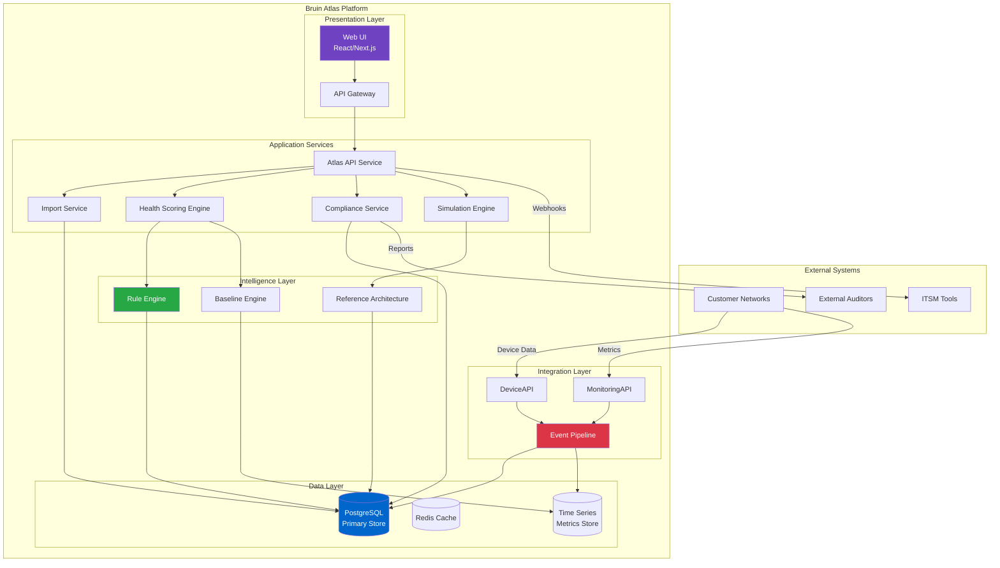
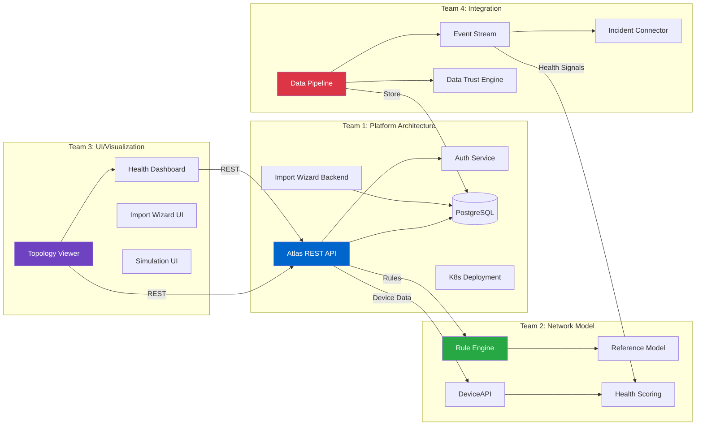
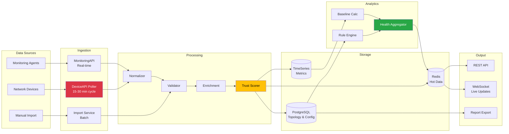
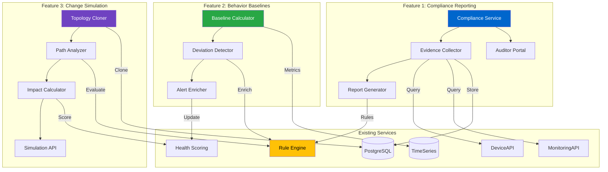
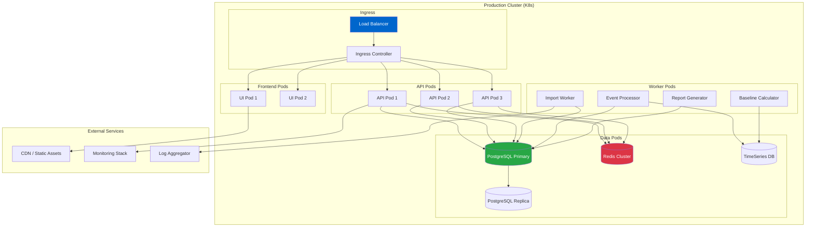
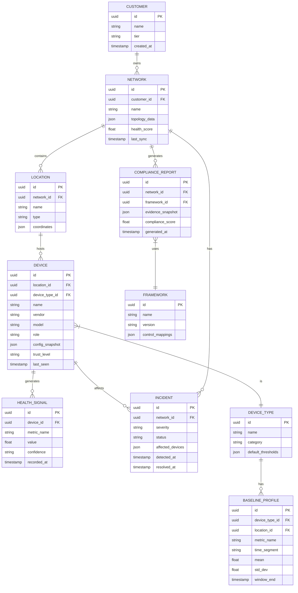

# Bruin Atlas Platform Architecture

This document provides comprehensive architectural diagrams with detailed explanations of each component, service, and design decision powering Bruin Atlas.

---

## High-Level System Overview



### Overview Description

The high-level system overview illustrates the complete Bruin Atlas platform architecture organized into five distinct layers, each with specific responsibilities and clear boundaries.

### External Systems

| System | Purpose | Integration Pattern |
|--------|---------|---------------------|
| **Customer Networks** | Source of all device data and metrics | Polled via DeviceAPI and MonitoringAPI |
| **ITSM Tools** | ServiceNow, Jira, PagerDuty integration | Outbound webhooks from Atlas API |
| **External Auditors** | Compliance report consumers | Read-only portal access via Compliance Service |

### Presentation Layer

The presentation layer handles all user-facing interactions:

- **Web UI (React/Next.js)**: Single-page application providing topology visualization, health dashboards, and configuration interfaces. Server-side rendered for initial load performance.
- **API Gateway**: Central entry point handling authentication, rate limiting, request routing, and API versioning. All external requests flow through this gateway.

### Application Services

Core business logic resides in these stateless, horizontally-scalable services:

| Service | Responsibility | Key Operations |
|---------|----------------|----------------|
| **Atlas API Service** | Primary REST API orchestrating all client requests | CRUD operations, query coordination, response aggregation |
| **Import Service** | Handles customer network data onboarding | File parsing, validation, normalization, deduplication |
| **Health Scoring Engine** | Computes real-time network health metrics | Score aggregation, trend analysis, threshold evaluation |
| **Compliance Service** | Generates audit-ready compliance reports (Phase 2) | Evidence collection, framework mapping, report generation |
| **Simulation Engine** | Runs "what-if" change impact analysis (Phase 2) | Topology cloning, path analysis, impact calculation |

### Intelligence Layer

The intelligence layer provides the "smarts" that differentiate Atlas:

- **Rule Engine**: Evaluates JSON-defined rules against network state. Detects redundancy gaps, compliance violations, and health anomalies. Supports both real-time evaluation and batch processing.
- **Baseline Engine**: Calculates statistical baselines per device type and location (Phase 2). Enables deviation detection and proactive alerting.
- **Reference Architecture**: Stores "gold standard" network topology patterns. Used for gap analysis and compliance scoring against best practices.

### Data Layer

Purpose-built storage for different data access patterns:

| Store | Technology | Use Case |
|-------|------------|----------|
| **PostgreSQL** | Relational DB | Topology, configurations, relationships, audit logs |
| **Redis Cache** | In-memory | Hot data, session state, real-time health scores |
| **Time Series Store** | InfluxDB/TimescaleDB | Metrics history, baseline calculations, trend analysis |

### Integration Layer

Connects Atlas to external data sources:

- **MonitoringAPI**: Pulls real-time metrics and alert data from customer monitoring infrastructure
- **DeviceAPI**: Queries device status, configurations, and capabilities from network devices
- **Event Pipeline**: Async message broker (Kafka/RabbitMQ) processing high-volume device events and routing to appropriate stores

---

## Service Architecture by Team



### Team Ownership Description

This diagram maps services to team ownership, illustrating clear boundaries and inter-team dependencies. Each team owns specific services end-to-end, from development through production operation.

### Team 1: Platform Architecture (2 Engineers)

**Mission**: Build and maintain foundational infrastructure enabling all teams to deliver value.

| Service | Description |
|---------|-------------|
| **Atlas REST API** | Central API gateway handling all client requests, authentication, and orchestration |
| **Auth Service** | JWT-based authentication, API key management, RBAC enforcement |
| **Import Wizard Backend** | Multi-step import workflow, file processing, validation pipeline |
| **PostgreSQL** | Database schema design, migrations, query optimization, backup/recovery |
| **K8s Deployment** | CI/CD pipelines, Kubernetes manifests, environment management |

**Key Responsibilities**: Security posture, data retention policies, API contracts, deployment automation.

### Team 2: Network Model (1 Engineer)

**Mission**: Encode network expertise into rules and standards that power Atlas intelligence.

| Service | Description |
|---------|-------------|
| **Rule Engine** | JSON-based rule definitions, evaluation logic, health scoring algorithms |
| **Reference Model** | Gold-standard network topology patterns, redundancy requirements |
| **DeviceAPI** | Device capability queries, status polling, vendor-specific integrations |
| **Health Scoring** | Aggregation logic combining rule outputs into actionable scores |

**Key Responsibilities**: Reference model governance, rule accuracy, device knowledge documentation.

### Team 3: UI/Visualization (2 Engineers)

**Mission**: Make complex network infrastructure comprehensible through intuitive visualization.

| Service | Description |
|---------|-------------|
| **Topology Viewer** | Interactive network graph with zoom, pan, filter, and drill-down |
| **Health Dashboard** | Executive-level health overview with trend visualization |
| **Import Wizard UI** | Guided multi-step import flow with validation feedback |
| **Simulation UI** | What-if analysis interface showing change impact (Phase 2) |

**Key Responsibilities**: UX design, performance optimization, accessibility, responsive design.

### Team 4: Integration (3 Engineers)

**Mission**: Deliver real-time operational intelligence through reliable data pipelines.

| Service | Description |
|---------|-------------|
| **Data Pipeline** | ETL workflows moving data from sources to Atlas stores |
| **Event Stream** | Real-time event processing, message routing, fan-out |
| **Incident Connector** | Bi-directional sync with rule engine and external ticketing |
| **Data Trust Engine** | Confidence scoring, freshness tracking, quality validation |

**Key Responsibilities**: Data freshness (12hr→15min), incident integration, data trust indicators.

### Cross-Team Dependencies

| From | To | Dependency |
|------|----|----|
| Team 3 (UI) | Team 1 (Platform) | REST API endpoints for all data access |
| Team 1 (Platform) | Team 2 (Network Model) | Rule evaluation, device queries |
| Team 4 (Integration) | Team 1 (Platform) | Database write access for pipeline outputs |
| Team 4 (Integration) | Team 2 (Network Model) | Health signal delivery for scoring |

---

## Data Flow Architecture



### Data Flow Description

This diagram traces how data moves through Atlas from source to consumer, highlighting transformation stages and storage decisions.

### Data Sources

| Source | Data Type | Volume | Freshness Requirement |
|--------|-----------|--------|----------------------|
| **Network Devices** | Status, config, topology | ~1000 devices/customer | 15-30 minutes |
| **Monitoring Agents** | Metrics, alerts, events | ~100K events/hour | Real-time (<5s) |
| **Manual Import** | Initial topology, bulk updates | One-time/periodic | Batch (minutes) |

### Ingestion Stage

The ingestion layer normalizes diverse data sources into a common format:

- **DeviceAPI Poller**: Scheduled jobs querying device status every 15-30 minutes. Implements backoff, retry, and rate limiting to avoid overwhelming devices.
- **MonitoringAPI**: Stream processor consuming real-time metrics. Handles burst traffic with buffering and back-pressure.
- **Import Service**: Batch processor for CSV/JSON uploads. Validates schema, detects duplicates, queues for processing.

### Processing Pipeline

Sequential processing ensures data quality before storage:

| Stage | Purpose | Key Operations |
|-------|---------|----------------|
| **Normalizer** | Convert vendor-specific formats to Atlas schema | Field mapping, unit conversion, ID normalization |
| **Validator** | Ensure data integrity | Schema validation, referential integrity, business rules |
| **Enrichment** | Add derived fields | Device classification, location inference, relationship detection |
| **Trust Scorer** | Assign confidence levels | Freshness check, source reliability, data completeness |

### Storage Strategy

Different stores optimize for different access patterns:

- **PostgreSQL**: Source of truth for topology, relationships, and configuration. Optimized for complex queries and transactional consistency.
- **TimeSeries**: Append-only metrics storage with time-based partitioning. Enables efficient range queries and downsampling.
- **Redis Cache**: Sub-millisecond access for hot data. Stores current health scores, active incidents, session state.

### Analytics Layer

Transform raw data into actionable intelligence:

- **Rule Engine**: Evaluates topology against reference model, detecting gaps and violations
- **Baseline Calculator**: Computes rolling statistics for anomaly detection
- **Health Aggregator**: Combines rule outputs and baseline deviations into unified health scores

### Output Channels

| Channel | Use Case | Latency Target |
|---------|----------|----------------|
| **REST API** | Dashboard queries, CRUD operations | <200ms p95 |
| **WebSocket** | Live topology updates, incident alerts | <1s |
| **Report Export** | Compliance reports, CSV downloads | Async (minutes) |

---

## Phase 2 Features: Service Dependencies



### Phase 2 Features Description

This diagram shows how the three Phase 2 features build upon existing platform services, minimizing new infrastructure while maximizing value delivery.

### Feature 1: Compliance Reporting (Blue)

**Goal**: Transform Atlas data into audit-ready compliance reports.

| Component | Purpose | Existing Service Dependency |
|-----------|---------|----------------------------|
| **Compliance Service** | Orchestrates report lifecycle | None (new service) |
| **Evidence Collector** | Gathers compliance evidence | DeviceAPI, MonitoringAPI for raw data |
| **Report Generator** | Produces formatted reports | Rule Engine for compliance rule evaluation |
| **Auditor Portal** | External auditor access | PostgreSQL for evidence storage |

**Key Insight**: 70% of required data already exists; primary work is transformation and templating.

### Feature 2: Behavior Baselines (Green)

**Goal**: Establish "normal" behavior patterns for proactive anomaly detection.

| Component | Purpose | Existing Service Dependency |
|-----------|---------|----------------------------|
| **Baseline Calculator** | Computes statistical profiles | TimeSeries DB for historical metrics |
| **Deviation Detector** | Identifies anomalies from baseline | Rule Engine for contextual evaluation |
| **Alert Enricher** | Adds baseline context to alerts | Health Scoring for unified output |

**Key Insight**: Statistical approach (no ML) using existing time-series data; rule engine provides correlation.

### Feature 3: Change Simulation (Purple)

**Goal**: Enable "what-if" analysis before network changes.

| Component | Purpose | Existing Service Dependency |
|-----------|---------|----------------------------|
| **Topology Cloner** | Creates in-memory topology copy | PostgreSQL for topology data |
| **Path Analyzer** | Traverses graph for impact | Rule Engine for redundancy evaluation |
| **Impact Calculator** | Computes health deltas | Health Scoring for before/after comparison |
| **Simulation API** | Exposes results to UI | None (new API endpoint) |

**Key Insight**: Simulation = running existing rules against modified topology state, not building a network simulator.

### Shared Foundation (Yellow)

All three features heavily leverage the **Rule Engine**, making it the central integration point:

- Compliance uses rules to evaluate compliance controls
- Baselines use rules to contextualize deviations
- Simulation uses rules to calculate hypothetical impact

**Implication**: Rule Engine must support "dry run" mode for simulation without side effects.

---

## Infrastructure Topology



### Infrastructure Description

This diagram details the Kubernetes deployment topology for production Atlas, showing pod allocation, scaling strategy, and external service integration.

### Ingress Layer

| Component | Technology | Purpose |
|-----------|------------|---------|
| **Load Balancer** | AWS ALB / GCP LB | SSL termination, DDoS protection, geographic routing |
| **Ingress Controller** | NGINX Ingress | Path-based routing, rate limiting, request logging |

**Scaling**: Load balancer scales automatically; ingress controller runs 2+ replicas for HA.

### Frontend Pods

| Component | Replicas | Resources | Scaling Trigger |
|-----------|----------|-----------|-----------------|
| **UI Pod** | 2-4 | 512MB RAM, 0.5 CPU | CPU > 70% |

**Details**: Serves static React bundle and handles SSR for initial page loads. Stateless; scales horizontally based on request volume.

### API Pods

| Component | Replicas | Resources | Scaling Trigger |
|-----------|----------|-----------|-----------------|
| **API Pod** | 3-10 | 1GB RAM, 1 CPU | CPU > 60%, latency > 200ms |

**Details**: Handles all REST API requests. Maintains connection pools to PostgreSQL and Redis. Health checks enable graceful failover.

### Worker Pods

Background processors handling async workloads:

| Worker | Purpose | Scaling Strategy |
|--------|---------|------------------|
| **Import Worker** | Process file uploads | Queue depth-based (autoscale on backlog) |
| **Event Processor** | Handle real-time events | Fixed replicas (high throughput, low latency) |
| **Baseline Calculator** | Compute statistical baselines | Scheduled (runs during off-peak hours) |
| **Report Generator** | Generate compliance reports | Queue depth-based (burst during audit season) |

### Data Pods

| Component | Topology | Backup Strategy |
|-----------|----------|-----------------|
| **PostgreSQL Primary** | Single leader | Daily snapshots, WAL streaming |
| **PostgreSQL Replica** | Read replica | Async replication (<1s lag) |
| **Redis Cluster** | 3-node cluster | RDB snapshots hourly |
| **TimeSeries DB** | Single instance | Daily retention-based archival |

### External Services

| Service | Provider | Purpose |
|---------|----------|---------|
| **CDN** | CloudFront/Fastly | Static asset delivery, edge caching |
| **Monitoring Stack** | Datadog/Prometheus | Metrics, alerting, dashboards |
| **Log Aggregator** | ELK/Splunk | Centralized logging, search, retention |

---

## API Service Map

```
┌──────────────────────────────────────────────────────────────────────────────┐
│                              ATLAS API GATEWAY                                │
├──────────────────────────────────────────────────────────────────────────────┤
│  /api/v1                                                                     │
│  ├── /auth                    Authentication & Authorization                 │
│  │   ├── POST /login          │  ├── POST /refresh                          │
│  │   └── POST /logout         │  └── GET  /me                               │
│  │                                                                           │
│  ├── /customers               Customer Management                            │
│  │   ├── GET  /               │  ├── POST /                                 │
│  │   ├── GET  /:id            │  └── PUT  /:id                              │
│  │                                                                           │
│  ├── /networks                Network Topology                               │
│  │   ├── GET  /:customerId    │  ├── GET  /:id/topology                     │
│  │   └── GET  /:id/health     │  └── GET  /:id/devices                      │
│  │                                                                           │
│  ├── /devices                 Device Operations                              │
│  │   ├── GET  /               │  ├── GET  /:id                              │
│  │   ├── GET  /:id/status     │  └── GET  /:id/baseline                     │
│  │                                                                           │
│  ├── /health                  Health & Scoring                               │
│  │   ├── GET  /dashboard      │  ├── GET  /scores/:networkId                │
│  │   └── GET  /trends         │  └── GET  /deviations                       │
│  │                                                                           │
│  ├── /incidents               Incident Management                            │
│  │   ├── GET  /               │  ├── GET  /:id                              │
│  │   └── GET  /active         │  └── PUT  /:id/resolve                      │
│  │                                                                           │
│  ├── /import                  Import Wizard                                  │
│  │   ├── POST /start          │  ├── POST /:id/upload                       │
│  │   ├── GET  /:id/status     │  └── POST /:id/complete                     │
│  │                                                                           │
│  ├── /compliance   [PHASE 2]  Compliance Reporting                          │
│  │   ├── GET  /frameworks     │  ├── POST /reports/generate                 │
│  │   ├── GET  /reports        │  └── GET  /reports/:id                      │
│  │                                                                           │
│  ├── /baselines    [PHASE 2]  Behavior Baselines                            │
│  │   ├── GET  /profiles       │  ├── GET  /deviations                       │
│  │   └── PUT  /config         │  └── GET  /alerts                           │
│  │                                                                           │
│  └── /simulate     [PHASE 2]  Change Simulation                             │
│      ├── POST /remove-device  │  ├── GET  /:id/results                      │
│      └── POST /batch          │  └── GET  /:id/export                       │
└──────────────────────────────────────────────────────────────────────────────┘
```

### API Service Map Description

This ASCII diagram documents all REST API endpoints, organized by domain. Each endpoint group serves a specific functional area of the Atlas platform.

### Core API Domains (Phase 1)

| Domain | Purpose | Key Consumers |
|--------|---------|---------------|
| **/auth** | Authentication and session management | All clients (UI, integrations) |
| **/customers** | Multi-tenant customer management | Admin UI, provisioning scripts |
| **/networks** | Network topology and health access | Topology Viewer, Health Dashboard |
| **/devices** | Individual device operations | Device detail views, search |
| **/health** | Health scores and trends | Executive dashboard, alerting |
| **/incidents** | Incident lifecycle management | NOC console, ITSM webhooks |
| **/import** | Data onboarding workflow | Import Wizard UI |

### Phase 2 API Additions

| Domain | Purpose | New Capabilities |
|--------|---------|------------------|
| **/compliance** | Compliance reporting | Framework listing, report generation, evidence access |
| **/baselines** | Behavior baseline management | Profile viewing, deviation queries, threshold config |
| **/simulate** | Change impact simulation | Device removal simulation, batch analysis, result export |

### API Design Principles

1. **RESTful conventions**: Resources as nouns, HTTP verbs for actions
2. **Versioned**: `/api/v1` prefix enables future breaking changes
3. **Consistent responses**: Standardized error format, pagination, filtering
4. **Auth required**: All endpoints except `/auth/login` require valid JWT
5. **Rate limited**: Per-customer limits prevent abuse (1000 req/min default)

### Authentication Flow

```
1. POST /auth/login → { email, password }
2. Response → { access_token, refresh_token, expires_in }
3. All subsequent requests: Authorization: Bearer <access_token>
4. Token refresh: POST /auth/refresh → { refresh_token }
```

---

## Database Schema Overview



### Database Schema Description

This entity-relationship diagram shows the core data model powering Atlas, with tables organized by domain.

### Core Entities

| Entity | Purpose | Key Relationships |
|--------|---------|-------------------|
| **CUSTOMER** | Multi-tenant root entity | Owns multiple networks |
| **NETWORK** | Customer's network infrastructure | Contains locations, has incidents |
| **LOCATION** | Physical or logical site | Hosts devices (HQ, branch, DC, cloud) |
| **DEVICE** | Network device instance | Belongs to location, generates signals |

### Device Classification

| Entity | Purpose | Usage |
|--------|---------|-------|
| **DEVICE_TYPE** | Canonical device categories | Router, switch, firewall, AP, etc. |
| **DEVICE.role** | Functional role in topology | Core, edge, access, WAN |
| **DEVICE.trust_level** | Data confidence indicator | Verified, inferred, stale, unknown |

### Health & Monitoring

| Entity | Purpose | Volume Considerations |
|--------|---------|----------------------|
| **HEALTH_SIGNAL** | Point-in-time device metrics | High volume; partitioned by time |
| **BASELINE_PROFILE** | Statistical profiles for baselines | Computed daily; moderate volume |
| **INCIDENT** | Active and historical incidents | Moderate volume; indexed by status |

### Compliance (Phase 2)

| Entity | Purpose | Key Fields |
|--------|---------|------------|
| **FRAMEWORK** | Compliance framework definitions | SOC2, ISO, PCI-DSS control mappings |
| **COMPLIANCE_REPORT** | Generated compliance reports | Evidence snapshot, score, timestamp |

### Schema Design Principles

1. **UUID primary keys**: Enable distributed ID generation, prevent enumeration
2. **JSON columns for flexibility**: `topology_data`, `config_snapshot`, `control_mappings` accommodate varying structures
3. **Timestamp tracking**: `created_at`, `last_seen`, `recorded_at` enable audit and freshness
4. **Soft references**: `affected_devices` as JSON array avoids complex junction tables
5. **Tenant isolation**: All queries filter by `customer_id` via application layer

### Index Strategy

| Table | Indexed Columns | Purpose |
|-------|-----------------|---------|
| DEVICE | `location_id`, `device_type_id`, `last_seen` | Topology queries, freshness checks |
| HEALTH_SIGNAL | `device_id`, `recorded_at` | Time-range metric queries |
| INCIDENT | `network_id`, `status`, `detected_at` | Active incident lookups |
| BASELINE_PROFILE | `device_type_id`, `location_id`, `metric_name` | Baseline retrieval |

---

*Diagrams and documentation created: 2026-01-06*
*Format: Mermaid (renders in GitHub, VSCode, most markdown viewers)*
