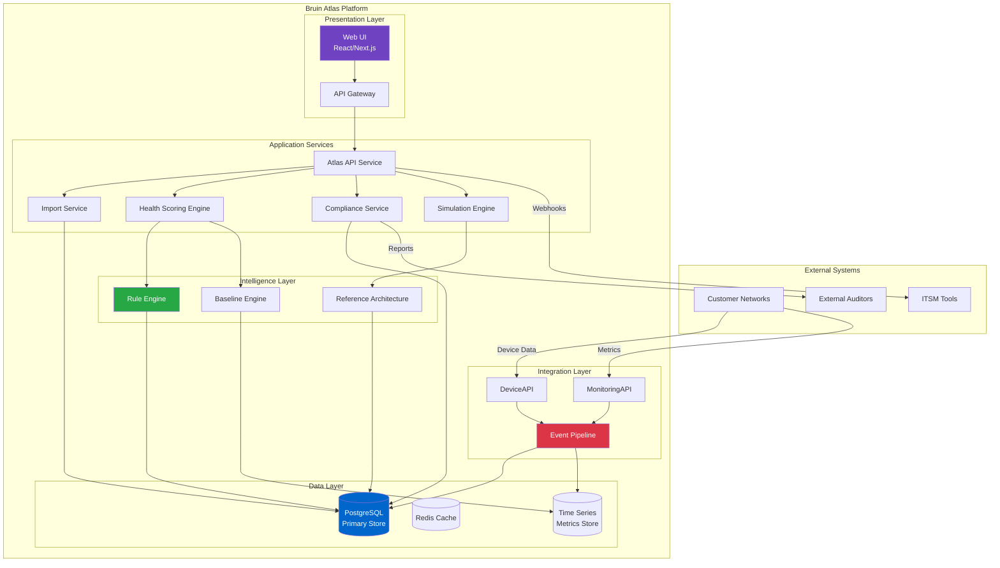
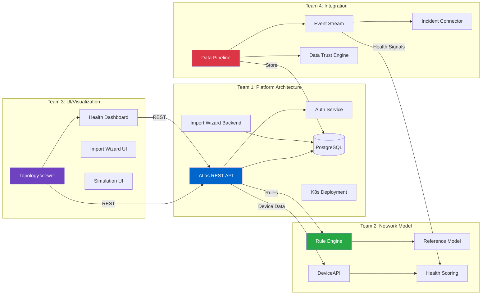
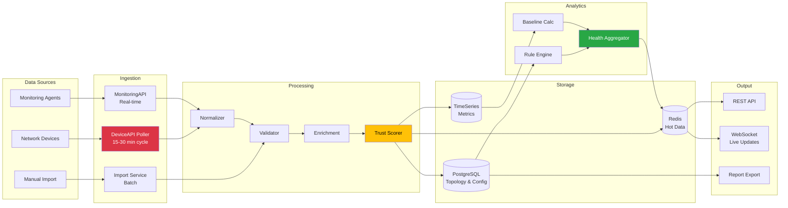
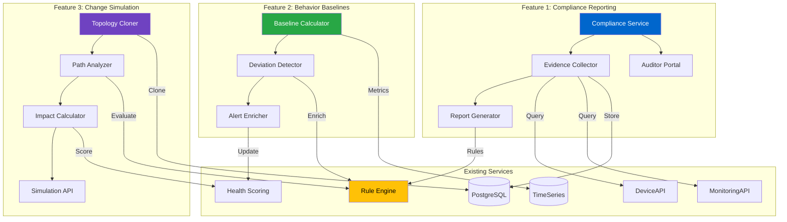
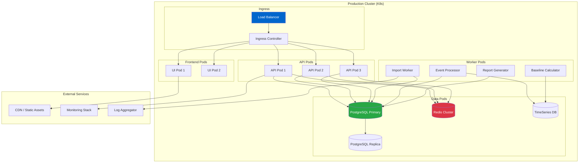
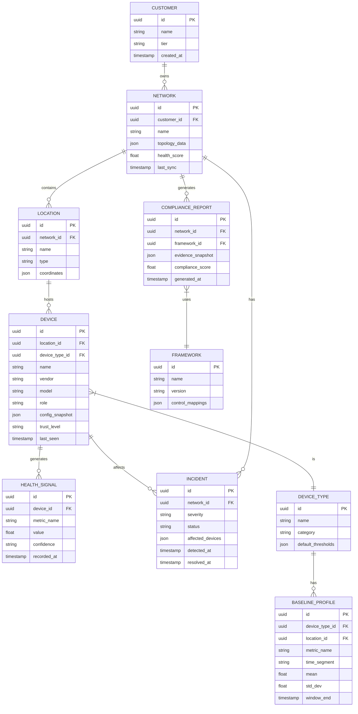

# Bruin Atlas Platform Architecture

## High-Level System Overview



---

## Service Architecture by Team



---

## Data Flow Architecture



---

## Phase 2 Features: Service Dependencies



---

## Infrastructure Topology



---

## API Service Map

```
┌──────────────────────────────────────────────────────────────────────────────┐
│                              ATLAS API GATEWAY                                │
├──────────────────────────────────────────────────────────────────────────────┤
│  /api/v1                                                                     │
│  ├── /auth                    Authentication & Authorization                 │
│  │   ├── POST /login          │  ├── POST /refresh                          │
│  │   └── POST /logout         │  └── GET  /me                               │
│  │                                                                           │
│  ├── /customers               Customer Management                            │
│  │   ├── GET  /               │  ├── POST /                                 │
│  │   ├── GET  /:id            │  └── PUT  /:id                              │
│  │                                                                           │
│  ├── /networks                Network Topology                               │
│  │   ├── GET  /:customerId    │  ├── GET  /:id/topology                     │
│  │   └── GET  /:id/health     │  └── GET  /:id/devices                      │
│  │                                                                           │
│  ├── /devices                 Device Operations                              │
│  │   ├── GET  /               │  ├── GET  /:id                              │
│  │   ├── GET  /:id/status     │  └── GET  /:id/baseline                     │
│  │                                                                           │
│  ├── /health                  Health & Scoring                               │
│  │   ├── GET  /dashboard      │  ├── GET  /scores/:networkId                │
│  │   └── GET  /trends         │  └── GET  /deviations                       │
│  │                                                                           │
│  ├── /incidents               Incident Management                            │
│  │   ├── GET  /               │  ├── GET  /:id                              │
│  │   └── GET  /active         │  └── PUT  /:id/resolve                      │
│  │                                                                           │
│  ├── /import                  Import Wizard                                  │
│  │   ├── POST /start          │  ├── POST /:id/upload                       │
│  │   ├── GET  /:id/status     │  └── POST /:id/complete                     │
│  │                                                                           │
│  ├── /compliance   [PHASE 2]  Compliance Reporting                          │
│  │   ├── GET  /frameworks     │  ├── POST /reports/generate                 │
│  │   ├── GET  /reports        │  └── GET  /reports/:id                      │
│  │                                                                           │
│  ├── /baselines    [PHASE 2]  Behavior Baselines                            │
│  │   ├── GET  /profiles       │  ├── GET  /deviations                       │
│  │   └── PUT  /config         │  └── GET  /alerts                           │
│  │                                                                           │
│  └── /simulate     [PHASE 2]  Change Simulation                             │
│      ├── POST /remove-device  │  ├── GET  /:id/results                      │
│      └── POST /batch          │  └── GET  /:id/export                       │
└──────────────────────────────────────────────────────────────────────────────┘
```

---

## Database Schema Overview



---

*Diagrams created: 2026-01-06*
*Format: Mermaid (renders in GitHub, VSCode, most markdown viewers)*
